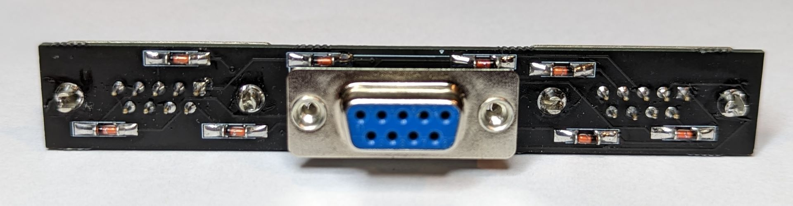
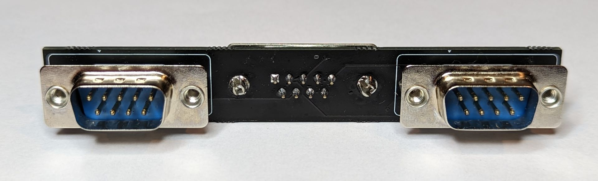
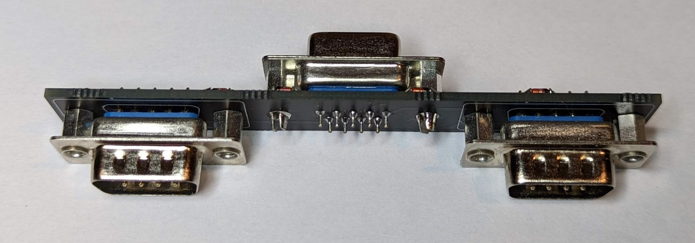
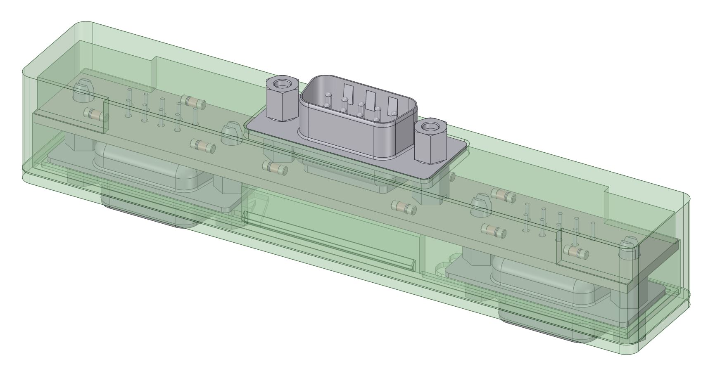
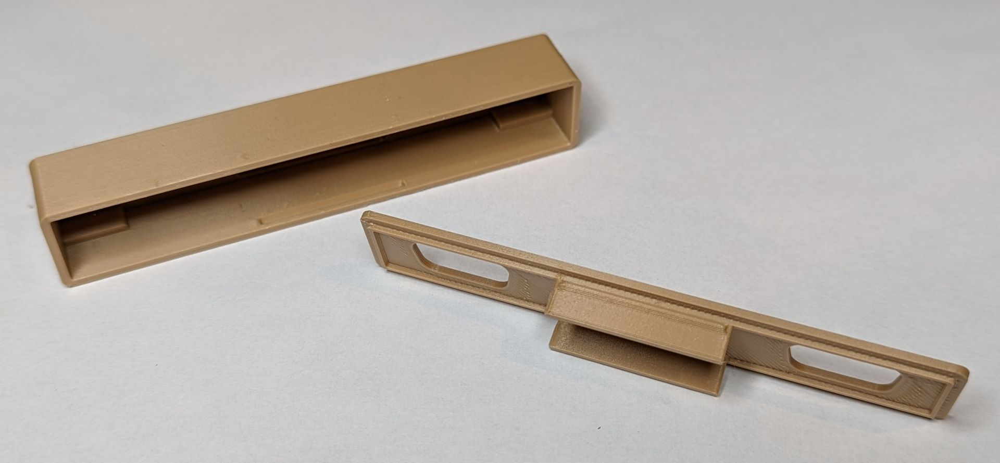
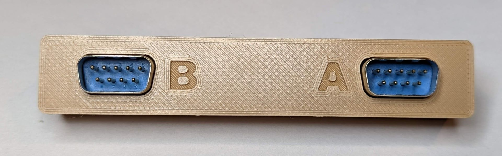
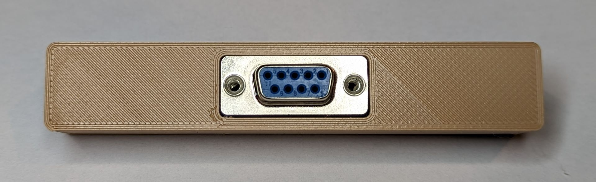

TI-99/4A joystick adapter allowing for the use of two standard Atari style DB9 joysticks.  BOM is super simple, I used these DB9's from AliExpress (similar to a TE [2301826-2](https://www.te.com/usa-en/product-2301826-2.html) and [2301838-2](https://www.te.com/usa-en/product-2301838-2.html) )

https://www.aliexpress.us/item/2255799921187046.html

and some LL4148 diodes in a MiniMELF form factor

https://www.aliexpress.us/item/3256802562651339.html

The top of the 4-40 lugs simply unscew from the DB9 sockets leaving the bottom part to securly mount to the PCB.

There is a snapfit 3D printable case in the **enclosure** directory.  Prints fine without any sort of supports, clearances are 0.2mm which work well on my Ender 3 style printer when printed in standard PLA. I included the DesignSpark file and STEP export of the populated board if you would like to improve on it further.

In the **gerbers** directory there is also a panelized version that will produce six boards on a standard 100x100mm PCB.  That was before JLCPCB started charging more for panelized design, so use at your your own (financial) risk these days.

